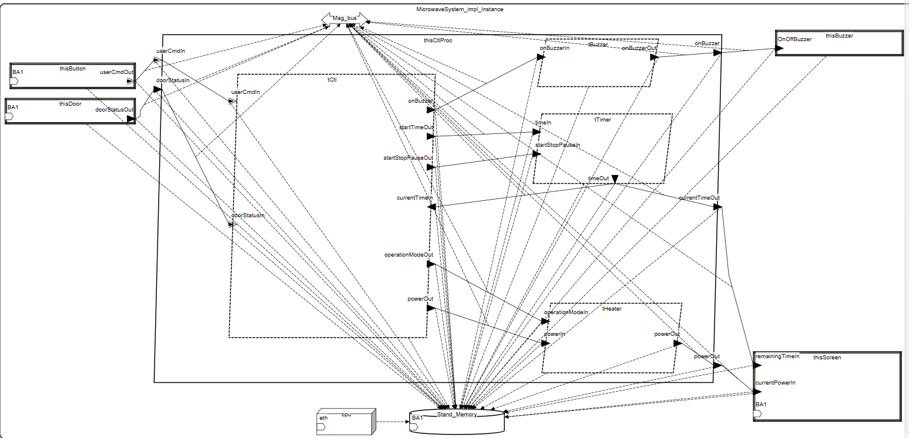

# Kuchnia mikrofalowa

---

## Dane studenta

- **Imię:** Jakub
- **Nazwisko:** Ciura
- **E-mail:** jciura@student.agh.edu.pl

---

## Opis modelowanego systemu

### Opis ogólny
Modelowany system to **kuchenka mikrofalowa** – urządzenie przeznaczone do podgrzewania oraz przygotowywania posiłków.

Główne funkcje kuchenki mikrofalowej obejmują:
- Podgrzewanie i rozmrażanie żywności,
- Odmierzanie czasu gotowania,
- Monitorowanie temperatury oraz obecności drzwi zamkniętych,
- Informowanie użytkownika o stanie pracy (np. dźwiękowe powiadomienia, wyświetlacz)

### Opis dla użytkownika

Z punktu widzenia użytkownika, obsługa kuchenki mikrofalowej jest intuicyjna i składa się z kilku kroków:

1. **Umieszczenie żywności:** Użytkownik otwiera drzwi i umieszcza jedzenie na talerzu obrotowym wewnątrz komory.
2. **Zamknięcie drzwi:** Drzwi muszą być zamknięte, aby możliwe było uruchomienie mikrofal.
3. **Wybór programu:** Użytkownik wybiera czas podgrzewania i/lub moc (np. za pomocą przycisków lub pokrętła).
4. **Start:** Po naciśnięciu przycisku "Start" rozpoczyna się proces podgrzewania. System weryfikuje warunki bezpieczeństwa (np. czy drzwi są zamknięte).
5. **Podgrzewanie:** W trakcie pracy użytkownik może zatrzymać działanie (pauza) lub anulować je całkowicie.
6. **Zakończenie:** Po zakończeniu podgrzewania rozlega się sygnał dźwiękowy, a urządzenie zatrzymuje generowanie mikrofal.
---

## Spis komponentów AADL z komentarzem
   
###  Pakiet: `MicrowaveSystem`

Zawiera wszystkie komponenty opisujące system mikrofalówki.

---

###  Common_Types
Zawiera stworzone typy danych, magistrale i pamięć

| Nazwa                  | Opis                                                                 |
|------------------------|----------------------------------------------------------------------|
| `HeatPower`            | Zakres mocy grzania od 0 do 100.                                     |
| `OperationMode`        | Tryby pracy: `OFF`, `HEATING`, `DEFROST`, `GRILL`.       |
| `UserCommand` | Dane wejściowe: tryb, moc, czas, sygnał start/stop.                 |
| `SystemStatus`| Dane wyjściowe: tryb, moc, drzwi, czas, moc aktualna, komunikaty. 
| `RAM`         		 | Pamięć używana przez urządzenia i procesor.   	
| `ethernet` 			 | Reprezentuje magistralę komunikacyjną (np. Ethernet). |

---

### Devices

| Nazwa         | Opis                                                                 |
|---------------|----------------------------------------------------------------------|
| `Door` | Czujnik drzwi – status drzwi i sygnał awaryjnego zatrzymania.        |
`Button` | Wejście użytkownika - czas, moc, tryb.        |
| `Timer`       | Obsługa czasu grzania – start, stop, timeout, pauza.                |
| `Heater`      | Urządzenie grzewcze – przyjmuje moc i zwraca faktyczną moc.         |
| `Screen`          | Wyświetlanie statusu. |                                 

---

###  Wątki

| Nazwa     | Opis                                                                  |
|-----------|-----------------------------------------------------------------------|
| `tTimer`  | Zarządza czasem pracy grzania.                                       |
| `tHeater` | Ustawia i odczytuje faktyczną moc grzania.                           |
| `tCtl`     |Kontroler, który zarządza wszystkim.            |

---

### Process

| Nazwa             | Opis                                                                 |
|-------------------|----------------------------------------------------------------------|
| `Controller`      | Główny kontroler – przetwarza polecenia i zarządza komponentami.     |

---

###  Processor

| Nazwa    | Opis                                                                    |
|----------|-------------------------------------------------------------------------|
| `corei5` | Procesor wykonujący wątki – planowanie Round Robin, okres zegara 1ms.  |

---

### System

| Nazwa                  | Opis                                                                  |
|------------------------|-----------------------------------------------------------------------|
| `MicrowaveSystem`      | Główna deklaracja systemu. Implementacja systemu – komponenty, połączenia, przypisania zasobów.                                            |

## Model - rysunek

---

## Wyniki przeprowadzonych analiz

---

## Inne informacje zależne od tematu

---
